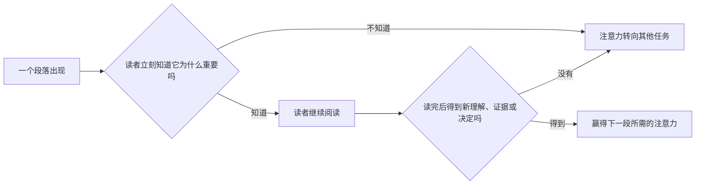

# Shit Skill 💩

> Explain the path, not just the nodes.

## 🚽 先别急着坐下

一次成功的拉屎，看起来只有一个目标，实际上有一整条不能乱跳的路径：

```text
💩 有需求
   ↓
🧭 找到厕所
   ↓
🚪 找对入口
   ↓
🧻 选择隔间
   ↓
⚙️ 执行
   ↓
✅ 检查结果
```

AI 协作也一样：

```text
发现问题
  -> 定位入口
  -> 找到相关路径
  -> 理解组件关系
  -> 建立因果解释
  -> 执行改动
  -> 验证结果
```

真正让人崩溃的，往往不是 AI 不知道答案，而是它已经读完 20 个文件，
最后只留下一句：

> “我改了 `b()`，问题解决了。”

等等，为什么从 `a()` 跳到 `b()`？为什么应该改这里？证据在哪？会影响什么？

**Shit Skill 不负责让 AI 说得更多。它负责让 AI 别跳步骤。**

---

## 🧠 这是什么？

Shit Skill 是一套面向低上下文人类的 AI 工作协议。

它要求 AI 把目标、上下文、探索路径、组件关系、因果链、原始证据、改动理由和
验证结果组织成一个人类能够理解、复述并继续使用的 mental model。

它不会要求 AI 暴露隐藏的 chain-of-thought，只要求输出可核验、与决策相关的解释。

核心标准是：

> 不要只告诉我你发现了什么。告诉我为什么走到这里，以及这个发现和目标有什么关系。

## 默认读者模型

Shit Skill 默认面对这样的读者：

- **Little context**：只知道自己要解决什么，不一定知道系统背景、历史决策和代码入口。
- **默认不了解领域**：不能假设读者已经理解领域术语、架构惯例、数学符号或省略掉的中间推导。
- **Low patience**：读者需要先看到结论和相关性，无法容忍无理由的绕路、仪式化铺垫，或者把同一句黑话重复两遍。

这里不把 `low IQ` 当成人的评价。它被转换成一条对解释者可执行的要求：
**如果读者需要自己补背景、拆术语、猜中间步骤，说明解释还没有完成。**
Agent 不应在回复中谈论这个读者模型，更不能居高临下；它只应主动承担理解成本。


这张图的重点是：Agent 负责把零散信息连接起来，不能要求用户在脑中自行组装。

## 注意力必须持续赢得

可以把一页内容想成同一窝里等待喂食的幼鸟。亲鸟一次只能带回有限的
食物，就像读者在一个时刻只能把有限的注意力给一件事。每个段落都在和
通知、任务、疲劳以及其他内容竞争；它必须尽早说明“我接下来能帮你解决
什么”，读者才有理由继续投入注意力。

这个比喻只解释注意力的稀缺和竞争。它不表示内容应该像幼鸟一样靠尖叫
取胜，更不支持标题党、故意卖关子、制造焦虑或堆放装饰。真正能留住注意力
的是相关性和持续回报：读者读完一节以后，必须比读之前多理解一层、多获得
一条证据，或者更接近一个决定。



因此，每一节都要兑现三个问题：

1. 这一节回答什么问题？
2. 为什么现在需要回答它？
3. 读完以后，读者具体得到了什么？

如果删掉一段话不影响理解、证据或决定，就删掉它。如果一节的价值要到
最后才看得见，就把足以证明“值得继续读”的部分提前。但不能为了短而删掉
必要背景；缺少背景会迫使读者自己补全关系，反而消耗更多注意力。

## 比喻必须是句子，不是词

单词级比喻看似简洁，实际会制造新的黑话：

> 不好：`adapter 是胶水`。

`胶水` 没有说明谁连接谁、怎么转换、失败后会发生什么。完整的句子级比喻应该像这样：

> 一个 adapter 像旅行插头转换器：调用方仍然使用自己熟悉的插头，adapter
> 把接口形状转换成目标服务能接受的形状，再把结果转回调用方认识的格式。
> 这个比喻只解释接口转换；它不表示 adapter 会供电，也不证明实现一定正确。

比喻必须映射真实系统里的角色、动作和结果，并明确比喻在哪一点失效。讲完以后还要回到准确的技术机制和证据。

## 🧱 三层结构

```text
ShitSkill/
├── rules/       # 什么必须始终成立？
├── modules/     # 有哪些可复用的方法？
└── scenarios/   # 当前任务如何组合并执行它们？
```

| Layer | Responsibility |
| --- | --- |
| **Rules** | 原子化行为约束，例如改动前解释原因、结论必须引用原始证据。 |
| **Modules** | 可复用的方法论，例如建立 mental model、追踪路径、验证结论。 |
| **Scenarios** | 面向具体任务的 runner，负责选择 rules、组合 modules、控制流程与停止条件。 |

```text
Rule     -> What must be true?
Module   -> How can we achieve it?
Scenario -> How do we compose it here?
```

Workflow、module 顺序、handoff 和迭代全部属于 scenario。Module 不选择
rules，也不调度其他 modules。

## 🔄 它如何工作？

```text
User request
    ↓
Select scenario
    ↓
Load rules + modules
    ↓
Build the required mental model
    ↓
Follow evidence-backed paths
    ↓
Act only after explaining why
    ↓
Verify and report with source references
```

最终目标不是“AI 遵守了多少条规则”，而是人类看完以后能自己回答：

- 我们在解决什么？
- 为什么要走这条路径？
- 完整的浅层节点图是什么，这一轮只深入哪几个节点？
- 这些组件是怎么连接的？
- 源码标识符是否保持原样，跨作用域改名是否明确写出？
- 哪张逻辑框图、时序图或状态图能让我不用在脑中拼装这些关系？
- 一个真实请求经过每个组件时，具体传了什么对象和值，哪些内容是临时的、哪些会保留？
- 具体运行时调用经过了哪些查找、分发、wrapper 和进程或 namespace 边界？
- 每个关键术语控制什么能力，缺少它会让哪一步发生什么变化？
- 黑话和压缩名词是否已经展开成“谁做什么、影响什么”的完整句子？
- 比喻是否说明了对应关系和失效边界，而不是只扔出一个形象词？
- 每一节是否说明了为什么值得继续读，并在消耗注意力后交付了新的理解、证据或决定？
- 数学概念是否按人的基础解释，是否只引入必要变量，公式怎么来的，前提为什么适用于当前问题？
- 为什么要做这个改动？
- 原始代码或文档证据在哪里？
- 结论依据是实现代码、部署配置、运行观测，还是仅仅是设计文档？
- 做完以后验证了什么？

## BFS + DFS 解释模式

复杂理解任务先做 breadth-first map，再做 depth-first explanation：

```text
完整的目标相关浅层节点图
  -> 选择当前最重要的最多三个节点
  -> 每个节点沿真实调用或逻辑路径深入到底
  -> 记录已解释、待追问和剩余节点
  -> 下一轮从同一队列继续
```

这里的 BFS 和 DFS 只控制用户看到解释的顺序，不限制 Agent 在内部读取
多少文件，也不允许它为了凑“三个节点”而截断一条真实调用链。一个节点可以
深入任意层，但每个源码跳转都必须继续带着原始证据。

源码里的名字不能被“说人话”顺手改掉。值在不同作用域中改名时，应明确写成：

```text
llm_proxy_source_root
  -> stored as
self.llm_proxy_source_root
  -> passed to the context manager as
source_root
```

这三个都是各自作用域中的真实标识符，不应被压成一个看似方便、实际并不存在
于所有源码位置的名字。普通解释可以另起一个简称，但必须明确说明它是解释者
定义的简称，不能伪装成源码标识符。

只有一个简单节点的问题可以省略显式节点图。用户明确要求一次讲完时可以超过
三个深挖节点，但仍然要先给全景图、保留原名，并让每个深层跳转都有证据。

## 🧰 已实现内容

### Rules

[29 条原子规则](rules/README.md)，覆盖：

- 低上下文、不了解领域、低耐心的默认读者模型；
- 上下文建立、注意力赢得与渐进披露；
- 跳转理由、具体运行场景、范围与抽象层级；
- 先广后深、每轮节点预算、跨轮解释状态与深层证据连续性；
- 术语展开、句子级比喻和非平凡关系可视化；
- 源码标识符保真、解释性简称标注与跨作用域改名映射；
- 因果关系和事实边界；
- 原文及代码行引用；
- 改动前解释；
- 成功前验证。

### Modules

- [`better-understanding`](modules/better-understanding/MODULE.md): 建立可被人脑执行和预测的 mental model，
  并把复杂关系画出来。
- [`breadth-depth-explanation`](modules/breadth-depth-explanation/MODULE.md):
  先列完整浅层节点图，再让每轮最多三个节点深入到底，并保留跨轮队列。
- [`better-explanation`](modules/better-explanation/MODULE.md): 把术语、压缩表达和比喻展开成低上下文读者能跟随的解释。
- [`top-down`](modules/top-down/MODULE.md): 从相关的高层结构逐步下钻到实现。
- [`path-navigation`](modules/path-navigation/MODULE.md): 解释为什么从一个节点走到下一个节点。
- [`causal-reasoning`](modules/causal-reasoning/MODULE.md): 建立有证据支撑的因果链。
- [`verification`](modules/verification/MODULE.md): 用与风险匹配的证据验证结论和改动。

### Scenarios

- [`bug-fix`](scenarios/bug-fix/SCENARIO.md)
- [`debugging`](scenarios/debugging/SCENARIO.md)
- [`code-review`](scenarios/code-review/SCENARIO.md)
- [`module-development`](scenarios/module-development/SCENARIO.md)
- [`repo-understanding`](scenarios/repo-understanding/SCENARIO.md)
- [`document-understanding`](scenarios/document-understanding/SCENARIO.md)
- [`architecture-understanding`](scenarios/architecture-understanding/SCENARIO.md)

每个 scenario 都是一份 executable specification，而不是固定回复模板。

## 📦 安装

让 TRAE 的 skill 目录指向本仓库：

```bash
ln -s /path/to/ShitSkill .trae/skills/shit-skill
```

入口文件是 [`SKILL.md`](SKILL.md)。

## 📚 设计来源

项目架构来自这次共享讨论：
[设计 Shit Skill](https://chatgpt.com/share/6a8ab070-43c4-83ee-868c-052316b860e5)。

一句话总结：

> 一个看似简单的目标，背后存在一条必须被正确执行的 workflow。
